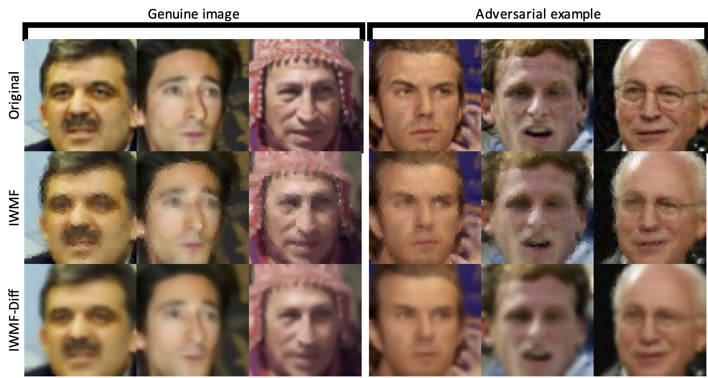
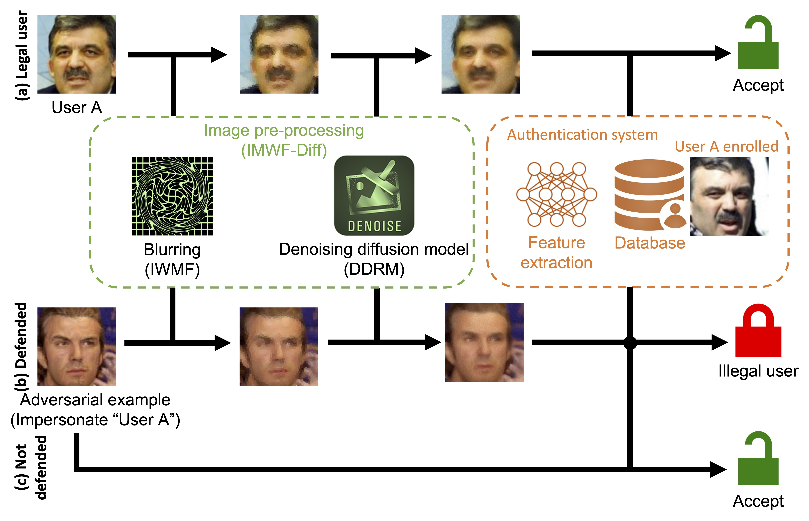

# Iterative Window Mean Filter: A New Image Filter Changes Diffusion-based Adversarial Purification

Hanrui Wang<sup>1</sup>, Shuo Wang<sup>2</sup>, Cunjian Chen<sup>1</sup>, Zhe Jin<sup>3</sup>, Soon Lay Ki<sup>1</sup>

<sup>1</sup> Monash University, <sup>2</sup> CSIRO, <sup>3</sup>Anhui Univeristy

Iterative window mean filter (IWMF) is a novel and super efficient non-deep-learning-based image filter, which gains comparable performance compared with the STOA adversarial defense. Taking advantage of IWMF, IWMF-Diff is a comprehensive framework for adversarial purification, which is applicable to any system as a pre-processing module against various attacks. IWMF-Diff gains superior performance than the SOTA defense.



****
## Contents
* [Introduction](#Introduction)
* [Main Requirements](#Main-Requirements)
* [Installation](#Installation)
* [Data Preparation](#Data-Preparation)
* [Pretrained Models](#Pretrained-Models)
* [Usage](#Usage)
* [Results](#Results)
* [Citation](#Citation)
* [Acknowledgement](#Acknowledgement)
* [Contacts](#Contacts)

****

## Introduction
The procedure of IWMF defending the authentication system is as follows:
* Step 1: Blur the input image by IWMF. Perturbations on adversarial examples are largely removed, yet facial features are partially distorted.
* Step 2: Further blur the image by Gaussian noise. This is essential for better restoration as DDRM is trained using Gaussian noise. Note that step 2 can be conducted using DDRM with step 3 together.
* Step 3: Restore image by DDRM. Robustness against both genuine images and adversarial examples raises.
* Step 4: Verify the pre-processed image by a regular authentication system. Note that users do not need to re-enroll due to the defense.



## Main Requirements

  * **Python (3.9.13)**
  * **torch (1.13.1+cu116)**
  * **torchvision (0.14.1+cu116)**
  * **eagerpy (0.30.0)**
  * **PyYAML (6.0)**
  * **tqdm (4.64.1)**
  
  The versions in `()` have been tested.

## Installation
```
git clone https://github.com/azrealwang/iwmfdiff.git
cd iwmfdiff
pip3 install -r requirements.txt
```
if equipped with GPU:

```
pip3 install torch torchvision --extra-index-url https://download.pytorch.org/whl/cu116
```
or:

```
pip3 install torch torchvision
```
## Data Preparation

The image name must satisfy the format `00000_0.jpg`. `00000` and `_0` indicates the image id and user id/class/label, respectively. The image id must be unique and auto-increment from `00000`.

<details>
  <summary><mark><font color=darkred> Genuine/target images </font></mark></summary>
  
To evaluate the authentication accuracy, genuine/target images must be prepared in the folder `inputs/genuine/`.
  
```
inputs
|---genuine
|     |---00000_0.jpg
|     |---00001_0.jpg
|     |......
|     |---00009_1.jpg
|     |---00010_1.jpg
|     |......
```
</details>

<details>
  <summary><mark><font color=darkred> Adversarial examples </font></mark></summary>

To evaluate the attack success rate, adversarial examples must be prepared in the folder `inputs/adv/`, which pair to genuine images.

```
inputs
|---adv
|     |---00000_0.jpg
|     |---00001_0.jpg
|     |......
|     |---00009_1.jpg
|     |---00010_1.jpg
|     |......
```
</details>

<details>
  <summary><mark><font color=darkred> Source images </font></mark></summary>

To evaluate the accuracy of classifying the adversarial examples as their true labels, source images must be prepared in the folder `inputs/source/`, which pair to adversarial examples.

```
inputs
|---source
|     |---00000_0.jpg
|     |---00001_0.jpg
|     |......
|     |---00009_1.jpg
|     |---00010_1.jpg
|     |......
```
</details>

20 input samples of each category have been prepared for running [demos](#Demos-of-defending-Insightface). The adversarial examples are produced by [SGADV](https://github.com/azrealwang/SGADV).

## Pretrained Models

* [InsightFace](https://insightface.ai): iresnet100 pretrained using the CASIA dataset; automatically downloaded

* [Denoising diffusion models](https://github.com/bahjat-kawar/ddrm): pretrained using the CelebA-HQ dataset; automatically downloaded

Sometimes, the download speed of denoising diffusion models is very slow. Then, please manually download the pretrained model from [Google Drive](https://drive.google.com/file/d/1ulkO2GFepl1IRlPjMRS_vsaVq5wG0p_x/view?usp=share_link) and prepare it as the path `exp/logs/celeba/celeba_hq.ckpt`.

## Usage
### Demos of defending Insightface
Without defense: `lambda_0=0` and `sigma_y=-1`

```
python main.py --lambda_0=0 --sigma_y=-1 --batch_deno=10 --thresh=0.6131 --log_name="noDefense"
```
IWMF: `lambda_0>0` and `sigma_y=-1`

```
python main.py --lambda_0=0.4 --sigma_y=-1 --batch_deno=10 --thresh=0.6611 --log_name="IWMF"
```
IWMF-Diff: `lambda_0>0` and `sigma_y>0`

```
python main.py --lambda_0=0.25 --sigma_y=0.15 --batch_deno=10 --thresh=0.6351 --log_name="IWMFDiff"
```
where the following are options:
- `lambda_0` is the window amount; `0` indicates no blurring. (default: `0.25`)
- `sigma_y` is the Gaussian standard deviation in [0,1]; `-1` indicates no denoising. (default: `0.15`)
- `s` is the window size (px). (default: `3`)
- `batch_deno` is the batch size for ddrm processing, depending on memory. (default: `1`)
- `thresh` is the system threshold. (default: `0.6351`)
- `log_name` is the log file name. (default: `"IWMFDiff"`)
- `logs_path` is the path of log files. (default: `"logs"`)
- `logs_path` is the path of output images; the processed adversarial examples are in the folder `adv/` and genuine images are in the folder `genuine/`. (default: `"outputs"`)

### Implementation for pre-processing
```
from fuctions.defense import iwmfdiff
```
```
def iwmfdiff(
	imgs_input: Tensor,
	lambda_0: float,
	sigma_y: float,
	s: int = 3,
	batch: int = 1
	) -> Tensor:
```

## Results

The results of the released pretrained model are as follows:

|         | White-box attack | Black-box attack |
| Defense | $FAR_{SGADV}$ (seen) | $FAR_{FGSM}$ | $FAR_{PGD}$ | $FAR_{CW}$ | $FAR_{DI^2-FGSM}$ | $FAR_{TI-FGSM}$ | $FAR_{LGC}$ | $FAR_{BIM}$ |
|:---:|:----:|:-----:|:-----:|:-----:|:-----:|:-----:|:-----:|:-----:|
| Result | 99.80 | 98.36 | 93.13 | 98.37 | 96.05 | 94.86 | 96.15 |


## Citation
This work is under review by [ACM CCS 2023](https://www.sigsac.org/ccs/CCS2023/).

## Acknowledgement
This implementation is based on / inspired by:
* [https://github.com/azrealwang/SGADV](https://github.com/azrealwang/SGADV) (adversarial examples generation)
* [https://github.com/bahjat-kawar/ddrm](https://github.com/bahjat-kawar/ddrm) (image restoration)
* [https://insightface.ai](https://insightface.ai) (deep learning model for face recognition)

## Contacts
If you have any questions about our work, please do not hesitate to contact us by email.

Hanrui Wang: hanrui.wang@monash.edu

